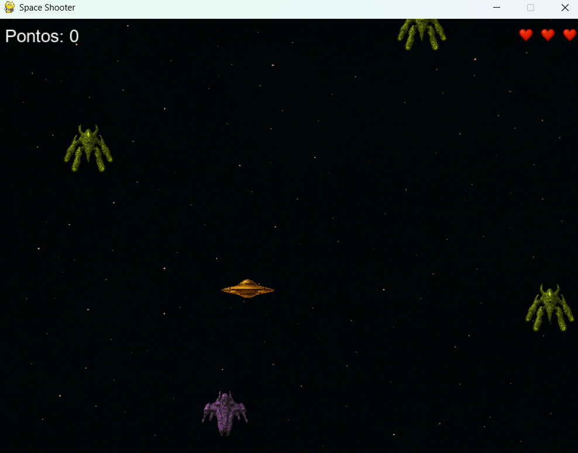

# 🚀 Space Shooter

Um jogo 2D estilo arcade desenvolvido em **Python** com **Pygame**, onde o jogador controla uma nave espacial, atira contra inimigos e enfrenta desafios crescentes. Ideal para portfólio e demonstração de habilidades em programação orientada a objetos e desenvolvimento de jogos.



---

## 🎓 Sobre o projeto

Este jogo foi desenvolvido como parte da minha jornada na **faculdade de Engenharia de Software**, com o objetivo de praticar Python, lógica de programação, estruturação de projetos e desenvolvimento de jogos com uso de bibliotecas gráficas.

Além de ser um exercício prático para fixar orientação a objetos, o projeto também é uma vitrine de evolução pessoal e técnica.

---

## 🎮 Funcionalidades

- Nave controlável com movimento suave
- Tiro com cooldown e animação
- Inimigos com sprites variados (espaçamento e velocidade aleatória)
- Colisões com animações de explosão
- Pontuação dinâmica
- Sistema de **vidas com ícones de coração**
- Tela de Game Over com botão de “Jogar Novamente”
- Estilo visual com **sprites personalizados** e **background espacial**

---

## 🧠 Tecnologias utilizadas

- Python 3.12
- Pygame 2.6
- Estrutura com classes (`Player`, `Enemy`, `Bullet`, `Explosion`)
- Modularização e separação por arquivos

---

## 📦 Como rodar o projeto

1. Clone o repositório:
   ```bash
   git clone https://github.com/OlgaBaia/space-shooter.git
   cd space-shooter
